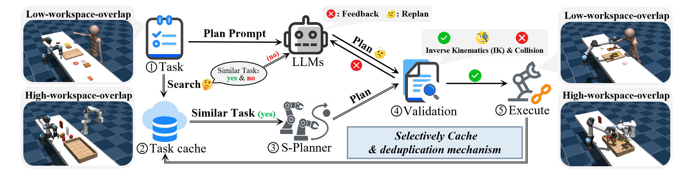

# MeCo: Enhancing LLM-Empowered Multi-Robot Collaboration via Similar Task Memoization

Codebase for paper: MeCo: Enhancing LLM-Empowered Multi-Robot Collaboration via Similar Task Memoization

Baiqing Wang, [Helei Cui](https://harrycui.github.io/), [Bo Zhang](https://bozhangcs.github.io/), [Xiaolong Zheng](https://xiaolongbupt.github.io/), [Bin Guo](http://www.guob.org/), [Zhiwen Yu](https://www.crowdos.cn/yu/publication.htm)

AAMAS 2026 | [Arxiv](https://arxiv.org/abs/2601.20577)



## Setup

### **setup conda env and package install**

```jsx
conda create -n meco python=3.8
conda activate meco
```

### **Install packages**

```jsx
pip install -r requirements.txt
```

### **Acquire LLM API Keys**

```jsx
from openai import OpenAI  
client = OpenAI(api_key="", base_url="https://api.deepseek.com")
```

## **Usage**

### **LLM-Empowered Method**

```jsx
$ conda activate MeCo
(MeCo) $ python run_llm.py --task A --comm_mode B
```

A: Select the task you want to execute, including sort, cabinet, rope, sweep, sandwich, pack.

B: Select the execution method: RoCo, Central, HAMS-2, ReAct.

### Similarity-aware **Method**

```jsx
$ conda activate MeCo
(MeCo) $ python run_similarity_high.py --task A
```

A: Select the task you want to execute, including sort, cabinet, rope, sweep, sandwich, pack.

There are two versions of the running script: run_similarity_high.py for high-workspace-overlap tasks; run_similarity_low.py for low-workspace-overlap tasks.

This script requires preparing a historical task library and specifying the task library path as shown below:

```jsx
self.run_dir = os.path.join(base_dir, "path1", "path2", run_name)
```

### MeCo

```jsx
$ conda activate MeCo
(MeCo) $ python run_meco_high.py --task A --comm_mode B
```

A: Select the task you want to execute, including sort, cabinet, rope, sweep, sandwich, pack.

B: Select the execution method: RoCo, Central, HAMS-2, ReAct.

There are two versions of the running script: run_meco_high.py for high-workspace-overlap tasks; run_meco_low.py for low-workspace-overlap tasks.

This script requires preparing a historical task library and specifying the task library path as shown below:

```jsx
self.run_dir = os.path.join(base_dir, "path1", "path2", run_name)
```

### MeCoBench

```jsx
$ conda activate MeCo
(MeCo) $ python run_mecobench_high.py --task A --mode C
```

A: Select the task you want to execute, including sort, cabinet, rope, sweep, sandwich, pack.

C: Select the mode of the benchmark you want to generate: similar, dissimilar, random.

There are two versions of the running script: run_mecobench_high.py for high-workspace-overlap tasks; run_mecobench_low.py for low-workspace-overlap tasks.

This script requires preparing a historical task library and specifying the task library path as shown below:

```jsx
self.run_dir = os.path.join(base_dir, "path1", "path2", run_name)
```

This script will generate random seeds that are similar/dissimilar/random to the current historical task library.

### Contact

Please direct to Baiqing Wang.

## Codebase adapted from:

Mandi, Zhao, Shreeya Jain, and Shuran Song. "Roco: Dialectic multi-robot collaboration with large language models." IEEE International Conference on Robotics and Automation (ICRA). 2024. [[RoCo Github](https://github.com/MandiZhao/robot-collab)]
